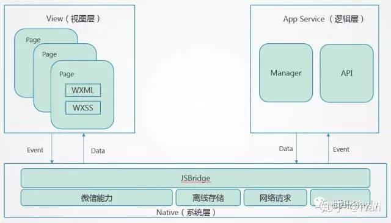

# 跨端原理探究

- [跨端原理探究](#跨端原理探究)
  - [1. 背景](#1-背景)
    - [1.1. 写在前面](#11-写在前面)
    - [1.2 各种框架一览](#12-各种框架一览)
  - [2. 编译时框架](#2-编译时框架)
    - [2.1 简述](#21-简述)
    - [2.2 静态编译](#22-静态编译)
      - [2.2.1 AST编译](#221-ast编译)
      - [2.2.2 Vue](#222-vue)
      - [2.2.3 React](#223-react)
    - [2.3 运行时](#23-运行时)
  - [3. 参考文章](#3-参考文章)


## 1. 背景
### 1.1. 写在前面

小程序目前百花齐放，各个超级大厂都有自己的小程序，而且实现细节、语法等和当时的浏览器大战一样各不相同。

而且小程序的渲染线程封闭性注定了无法通过外部方式自行渲染，而且目前来看不会放开。
   
### 1.2 各种框架一览
|名称|出品方|框架偏好|备注
|:-:|:-:|:-:|:-:|
|nanachi|去哪儿|React|凉了|
|Wepy|腾讯|Vue|凉了|
|mpVue|美团|Vue|凉了|
|megalo|网易|Vue|凉了|
|uni-app|DCloud|Vue|维护中|
|chameloen|滴滴|Vue|凉了|
|Rax|淘宝|React|维护中|
|Taro v1/v2|京东|React|-|
|Remax|蚂蚁|React|维护中|
|Taro v3|京东|-|维护中|

小程序开发框架一个接一个，但整体来看跨端方案的实现思路基本分属于两个方向：

1. 静态编译型 - **主要工作在编译阶段**
2. runtime运行时型 - **主要工作在运行时**

## 2. 编译时框架
### 2.1 简述

> 编辑过程仿佛一个转换头, 不论什么框架的代码，通过编译，变成小程序的可执行代码。


### 2.2 静态编译

#### 2.2.1 AST编译

1. 使用 `@babel/parser` 将代码解析成抽象语法树AST
2. 使用 `@babel/types` 对AST修改转换，抹平Vue和小程序的差异
3. 最后使用 `@babel/generator` 生成代码。


#### 2.2.2 Vue
一个标准微信小程序组件包括 `.wxml` 、`.wxss` 、`.js` 和 `.json`四部分。

一个标准Vue组件包括 `template` 、`script` 和 `style` 三部分。

将一个Vue组件静态编译成一个小程序组件就是将这三部分转换成小程序的四部分

> 大多数的静态编译框架都在使用`Vue`, 主要得益于Vue的单文件模板渲染能力和小程序差异不大。
> 
> 开发者在实现框架能力时，可以将Vue的单文件编译能力(vue-loader)、响应式系统(数据双向绑定)、虚拟Dom、Diff更新算法等能力全套直接使用。
> 
> 只需要着眼于小程序缺失的能力（DOM操作、数据视图绑定等）。

- `style` 最简单，一般的CSS样式都可以直接应用在 `.wxss` 中，只需要处理一些不支持的属性和单位等。
  - 处理转换不支持的属性配置
  - 单位处理 `px` => `rpx`

- `template` 相对复杂一点，需要将vue中的模板语法转换成小程序的模板语法。

  - `v-if` => `wx:if`
  - `div` => `view`
  - `@click` => `bindtap`‘
  - ···

- `js` 最复杂，要考虑运行时的生命周期、事件、数据通信等等，Vue数据和小程序数据通信。
  - `new Vue({ ... })` => `Page({ ... })`

> 不同的类Vue跨端框架实现原理基本相同，在编译过程中**重写Vue的Init函数**， 其内部会捎带上Page函数调用。
> 
> 这样执行完代码后一个小程序页面中会存在一个Vue实例和一个Page实例。

完整的Vue组件渲染流程如下图：


执行完Patch之后，Vue内部会通过DOM的API来更新视图层。

然而小程序具有独特于浏览器的架构（View层、App Service层、Native层）。



从逻辑层驱动视图层更新只能依靠原生的`setData`函数，因此类Vue框架都在运行时runtime中做了类似的处理，调用`setData`取代`Javascript DOM操作`。


回过头看，这些跨端框架在Vue能力的基础上，完善了一套小程序规范的静态编译能力，同时结合小程序的原生更新逻辑实现了一套独立的运行时runtime。


#### 2.2.3 React

实现思路类似Vue框架却又不同。

`React` 内部使用 `JSX` 语法。

类比Vue中的模板解析，在React中要解析的模板变成了 `JSX`。

一个简单的例子
```jsx
// 编译前
import { View } from '@xxx/components'
class Comp extends Component {
  render() {
    return (
      <View className="view">Hello World</View>
    );
  }
}
// 编译后
<view wx:if="{{ compReady }}">
  <view class="view">Hello World</view>
</view>

Page(require('**/**/components/index.js').createComponent('Comp'))
```

然而由于JSX灵活的特性（用JavaScript的方式写DOM），我们使用`JSX`可以很方便的写出非常复杂的业务组件，但是在编译阶段 逻辑分析难度会成倍的增加，甚至，有可能会解析错误。

类Vue的框架 （诸如 `Taro v1/v2`等）都只能通过文档标注 `JSX` 的推荐写法，以及频繁的对编译时的JSX写法进行穷举，适配。


这也是现如今类React的跨端框架都抛弃这种方式的最大原因。

### 2.3 运行时

运行时框架的实现思路和静态编译框架不同，最早由蚂蚁金服在2020年`SEE Conf`上提出（推广自研的`Remax` 跨端框架）。


1. React Component API
  
    代码很少。

2. React Reconciler
   
   代码很多，而且是Fiber调度的核心，负责React内部的调度和更新，包括了Diff/Fiber算法，组件是否更新，需要更新什么都是在这里决定的。
3. React Renderer

    负责具体某个平台的渲染，对应的Web渲染器就是大家熟知的 `react-dom`

运行时框架主要动刀的地方就是`React Renderer`，不论是`Taro`还是`Remax`，都是在这个模型的基础上自行实现了一个基于小程序更新逻辑的Renderer渲染器，这样，一个完整的`React`就运行在了小程序中。

正如`Remax` 推广时的Slogan`使用真正的 React 构建小程序` 一样，将框架的运行时完美的结合到小程序端。

## 3. 参考文章

1. [2020 SEE Conf Remax - 使用真正的React构建小程序](https://www.yuque.com/seeconf/2020/qsytho)
2. [2万字长文 深入浅出主流的几款小程序跨端框架原理](https://juejin.cn/post/6881597846307635214#heading-19)
3. [Taro 官方文档](https://taro-docs.jd.com/docs)
4. [Remax Github](https://github.com/remaxjs/remax)
